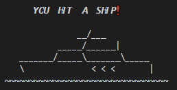
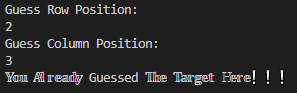
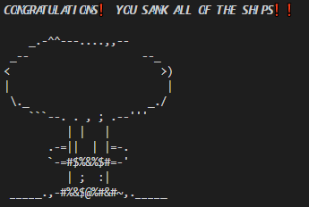
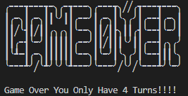
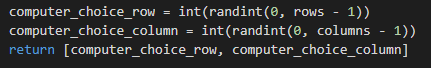
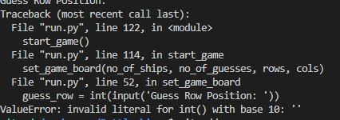
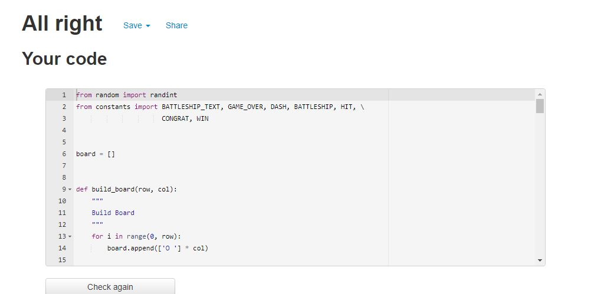

# Battleships Python Game
#
Battleships is a python based game which runs inside the Python terminal
The user needs to find the computers battleship positions and sink the ship by guessing the correct row and column for each ship.  
There are 5 level settings from 1 to 5. 1 being the easiest where there is a grid size of 4 x 4 with 3 ships and 5 guesses allowed. Level 5 has a larger grid size of 7 x 7 grid with only 2 ships and 4 guesses.  

## How To Play
#
To play the game you need to guess the computers positioning of the ship. The computer will generate a random position within the grid for you to guess the exact position when prompted within the terminal. The user is asked to input their required level between 1 and 5. The user is then asked to enter a column position, followed by a row position.  
The user guesses the positions and is offered a message of whether or not they hit a ship. This is followed by either a H, for hit, or X, for a miss, which is placed onto the eboard at the guessed position.

 

The example shown above shows a 5x 5 board with the X at row 2 / column 2. This X marks where a previous position was chosen but missed. The user will be presented with a print statement stating that the shot missed the target.
#

#
If the user is to guess the same position again they willbe presented with a message stating this.

After each shot taken the guess countdown counts the users guess and increments within the terminal stating the number of turns left for the user.

When the position is guessed correctly then the user is presented with a message to let them know that they have hit the ship.
#

#
If the user is to guess the same position again they will be presented with a message stating this.
#
  
#
Once all of the ships have been hit the user is presented a message stating that all ships have been destroyed.  
#

#

If the user runs out of guesses the game is finished and the user is offered a Game Over message along with the number of guesses used, which is dependant on game level.

## Data Model

#
## Testing

I tested the project throughout the coding process by printing the computers guesses out to the terminal allowing me to guess the correct or incorrect positions while checking that the code worked.  
Once I was happy with the code I then deployed it to Heroku and tested again, where more bugs became apparent.  
I had to then change the code, add, commit and push each time to allow the code to be tested in the Heroku mock terminal. 

#
## Bugs

I came across alot of bugs throughout the testing phase of the project, mainly through lack of validation functions.  
One of the first bugs that I came across was "list assignment index out of range" This was due to me only using one random generated number between 0 and 24 not taking into account that I had looped a list of 5 O's 5 times meaning that the index would only ever be between 0 and 4 and this needed to be twice. Once for the row and again for the column.  This was again an issue later on when I added an option for level selecting as now the random numbers had to be generated in range of 0 and the board size columns and rows. This was rectified by adding a randit between 0 and column/row -1. 
#
  
#
 The second most common error was "invalid literal" Value Error displaying after entering either a string or pressing Enter this was rectified by adding functions that validating the user input.  
#
 
#
The biggest bug that I found difficult to rectify was following deployment of the program in Heroku.  
The program was working perfectly within the Python Terminal but worked totally different within the Heroku mock terminal. The code seemed to display backwards where user input was requested after the user had input the column, row integers and also the hit/miss prints were showing at the same time as the input request.  
This was rectified by changing the code to print seperately within the functions.

#
## Validator Testing

I passed the code through the PEP8 validator. There were 7 errors shown within PEP8.
#
  
#
After rectifying the PEP8 errors the code shows back as clean.
#

#
## Deployment
#
## Credits
#