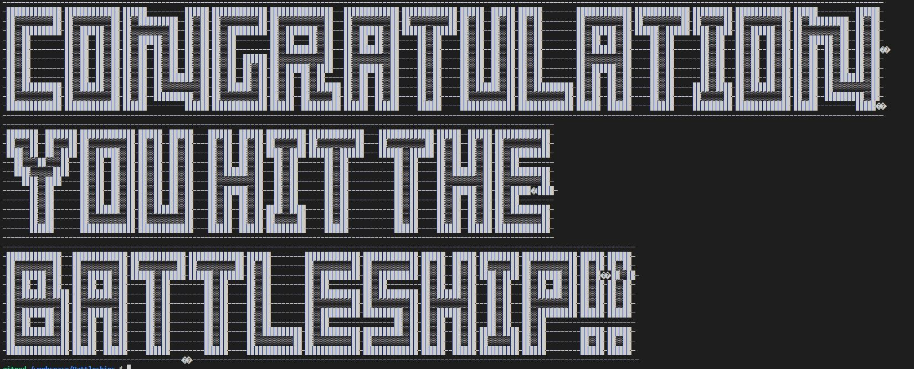

# Battleships Python Game
#
Battleships is a python based game which runs inside the Python terminal
The user needs to find the computers battleship position and sink the ship by guessing the correct row and column.

## How To Play
#
To play the game you need to guess the computers positioning of the ship. The computer will generate a random position within the grid for you to guess the exact position when prompted within the terminal. Use numbers between 0 and 4 to choose column/row positions. As shown below.

Each miss will marked with an X to ensure that the position isn't chosen more than once. 

The example shown above shows the X at row 2 / column 2. This X marks where a previous position was chosen but missed. The user will be presented with a print statement stating that the shot missed the target.

If the user is to guess the same position again they willbe presented with a message stating this.

The user gets a total of five shots to guess the correct position. After each shot taken the guess countdown counts the users guess and increments within the terminal stating the number of turns left for the user.

When the position is guessed correctly then the user is presented with a message to let them know that they have sank the ship.

If the user is to guess the same position again they wi!llbe presented with a message stating this.

The user gets a total of five shots to guess the correct position. After each shot taken the guess countdown counts the users guess and increments within the terminal stating the number of turns left for the user.

When the position is guessed correctly then the user is presented with a message to let them know that they have sank the ship.

## Data Model

#
## Testing

I tested the project throughout the coding process by making the terminal print the computers guesses out to the terminal to allow my to guess the correct or incorrect positions while checking that he code worked.

#
## Bugs

1. The first bug that I came across was "list assignment index out of range" This was due to me only using one random generated number between 0 and 24 not taking into account that I had looped a list of 5 O's 5 times meaning that the index would only ever be between 0 and 4 and this needed to be twice. Once for the row and again for the column.
2. When deployed to Heroku program did not run the same as Python Terminal 
#
## Validator Testing

I passed the code through the PEP8 validator where the only faults found are due to text decoration used for the terminal statement output.
#
## Deployment
#
## Credits
#